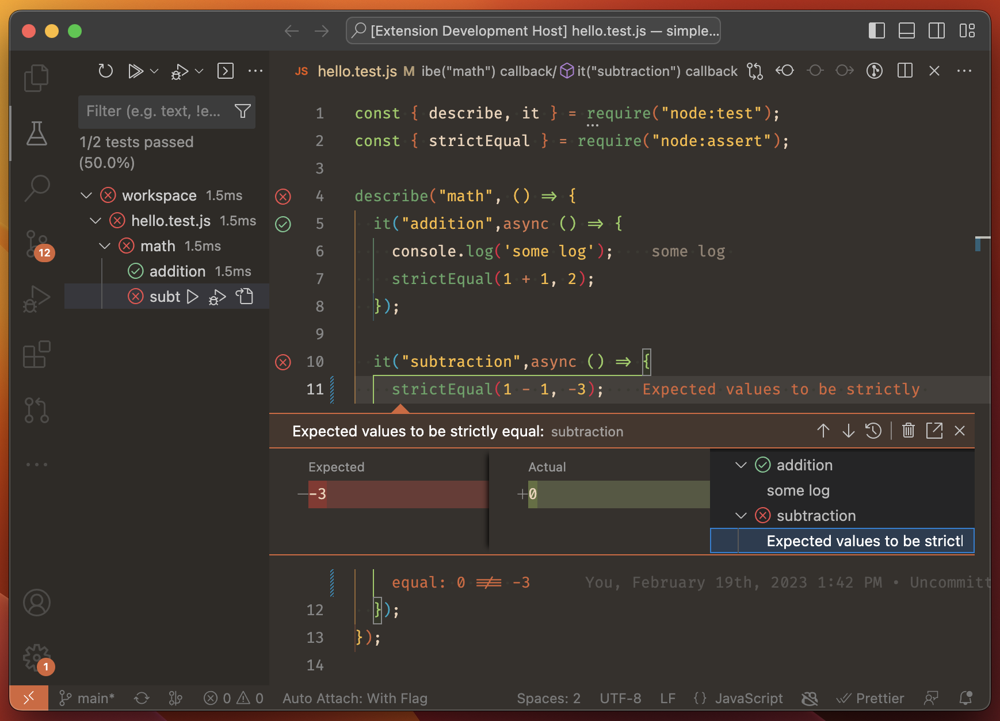

# nodejs-testing

Provide integration with VS Code using the [`node:test` runner](https://nodejs.org/api/test.html). Simply install the extension and start running tests, no setup required.[\*](#having-problems-read-this)

**This extension requires Node.js >=19**: `node:test` is quite new and did not offer features we need in prior versions.

## Having Problems? Read this!

- The extension looks for files that use the [Node.js test runner naming convention](https://nodejs.org/docs/latest-v20.x/api/test.html#running-tests-from-the-command-line). Make sure your files are named correctly!

- The Node.js test runner only supports running JavaScript files. If you have a compilation step, you'll need to make sure that runs **with sourcemaps** so we can figure out where tests appear in your source code. For example, for TypeScript, set `"sourceMap": true` in your tsconfig.json.

- If tests aren't initially found in your workspace folder, this extension won't keep watching for changes. Manually run the "refresh tests" action if you later add some (or just reload your window.)


_Theme: [Codesong](https://marketplace.visualstudio.com/items?itemName=connor4312.codesong)_

## Configuring

- `nodejs-testing.include` is the list of directories in which to look for test files, relative to your workspace folder. Defaults to `['./']`.
- `nodejs-testing.exclude` is the list of glob patterns that should be excluded from the search. Defaults to `['**/node_modules/**']`.
- `nodejs-testing.concurrency` is how many test files to run in parallel. Setting it to 0 (default) will use the number of CPU cores - 1.
- `nodejs-testing.nodejsPath` is the path to the Node.js binary to use for running tests. If unset, will try to find Node on your PATH.
- `nodejs-testing.pretest` is a command to execute before tests are run. For example `["npm", "run", "pretest"]`. The working directory for the script is the workspace folder.
- `nodejs-testing.extensions` is a list of test extensions to search for, and optional additional Node.js parameters to pass when running those test files. It defaults to

  ```json
  [
    {
      "extensions": ["mjs", "cjs", "js"],
      "parameters": []
    }
  ]
  ```

  ...but is useful for configuring loaders for other file types. For example, to run TypeScript tests, you could use

  ```json
  {
    "nodejs-testing.extensions": [
      {
        "extensions": ["mjs", "cjs", "js"],
        "parameters": []
      },
      {
        "extensions": ["mts", "cts", "ts"],
        "parameters": ["--import", "tsx"]
      }
    ]
  }
  ```

  You can also import other helpers by adding parameters like `["--import", "${workspaceFolder}/path/to/file.js"]`. See the [Node.js command line API](https://nodejs.org/api/cli.html) for a full list of options.

  Finally, in _addition to_ an `extensions` option, you can inspect specify a `filePattern` option if you want to name your files differently than the default [naming scheme](https://nodejs.org/docs/latest-v20.x/api/test.html#running-tests-from-the-command-line).
